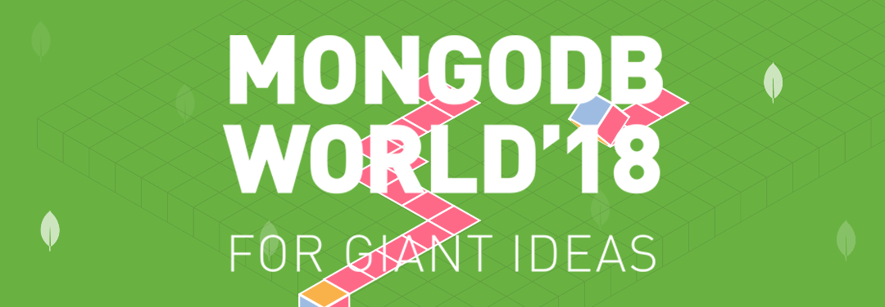

# Getting MEAN
## An Introduction to API-Centered Application Development with Node.js and MongoDB

## Ticket 2: Running Node.js

Part of becoming a MEAN Stack hero is running Node.js from command line.  In order to do that you should have already installed Node.js and have the ability to create a javascript application that will be transpiled by Node.js for execution.  

This specific ticket is going to require that you create a javascript Node.js script that outputs "Hello World".

### Node.js

Make sure you've got Node.js installed.  Open a command window, or, use the integrated `terminal` within `Visual Studio Code`.  Test whether node.js is installed by typing/running:

```
$ node --version
v9.11.1
```

Next, let's write a very simple Node.js script.  Make sure you're in the root directory of your project and create a file with the following contents:

```
console.log('hello world');
```
Now we can test it by running it with the `node` command:

```
Michaels-MacBook-Pro-2:getting-mean mlynn$ node helloworld.js
hello world
```

You're on your way to becoming a hero.  Jump to [ticket 3](../workshop/ticket3.md) if you're up for the challenge.

## Resources

* [Node.js](https://nodejs.org)
* [Installing Node.js on Windows](https://nodesource.com/blog/installing-nodejs-tutorial-windows/)
* [Installing Node.js on Mac OS](https://nodesource.com/blog/installing-nodejs-tutorial-mac-os-x/)
* [NPM Downloads](https://mongodb.com/download)

## Concepts

* Executing Node.js from command line.

## Hints

None.

## Next Ticket

[ticket 3](../workshop/ticket3.md) - Installing NPM