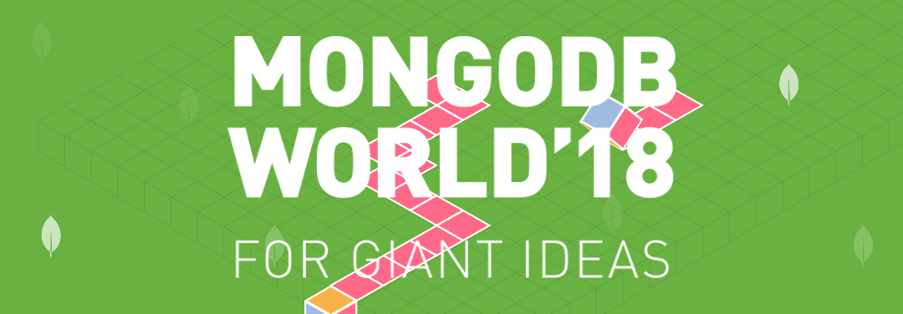

# Getting MEAN
## An Introduction to API-Centered Application Development with Node.js and MongoDB
## Ticket 1: Create a Server, Listener Process
Our application will require a process that listens for incoming connections on a given port.  This port may change based on the environment available on the server where the application runs.  Hint, this is typically available in our Node.js application through a variable called `process.env.PORT`.  If set, we should leverage that specific port, otherwise, we should leverage port 3000.

In order to create a server or listener process, we have several options.  The first option - and probably easiest is to leverage a standard library called `http`.  This is the easiest option because we won't have to install any depdencies or additional libraries to use it.  We can just summon it's heroic powers using the following:

```
const http = require('http');
```

Once we've created a variable (constant) with a reference to the package, we can begin to use it's powers:

```
const server = http.createServer();
server.listen(3000);
```

This is the simplest way to create a server / listener.  

 Library packages are typically installed for us use a package dependency manager - one solution is NPM or Node Package Manager.  A very common library used to create a listener is called `http`.

Here's an overview of the things we'll need to accomplish to close out this ticket:

* Initialize our Node.js project with a `package.json` file.  See `npm init`.
* Install the dependency library we'll use to create a server listener.  See `npm install --save http`.
* Create a server.js JavaScript application file and instantiate a call to the server library to create a listener.
* Create an JavaScript app file that will store the bulk of the logic for our application.  This is typically called app.js.  Be sure you export the module functions that you create.  See [Module Exports Documentation](https://nodejs.org/api/modules.html#modules_exports) for additional details on this concept.
* Require that app file in your server process.

## Resources

* [Node.js Documentation](https://nodejs.org/en/docs)
* [HTTP Library Documentation](https://www.npmjs.com/package/http)

## Concepts

* [Application Programming Interfaces (APIs)](https://en.wikipedia.org/wiki/Application_programming_interface)


### IP Whitelist

### .env file

## Helpful Hints
We'll be doing this together. If you have a question or problem, let one of the mentors know.

## Next Ticket
You now have your very own Atlas M0 Cluster, but it doesn't have any data. Next, we'll populate it with movie data. 

Next Ticket: `workshop/ticket4.md`
